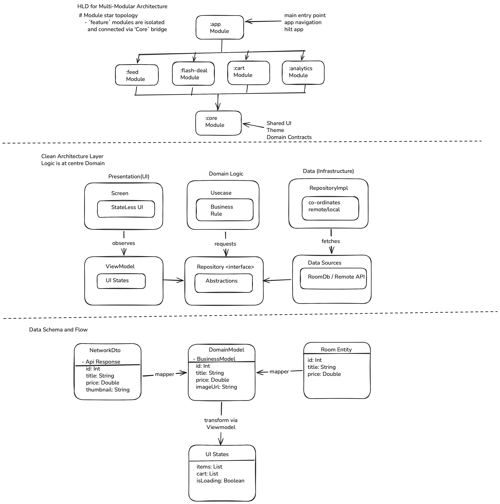

# EKart

EKart is a multi-module Android e-commerce app built with Clean Architecture, Jetpack Compose, and modern Android libraries. It is designed to be offline-first and uses a type-safe navigation system.



## Strategic Architecture Decisions

### 1. Offline-First Strategy (Room + RemoteMediator)
*   **Approach:** Single Source of Truth (SSOT).
*   **Reasoning:** I chose to use Room as the exclusive data source for the UI. By implementing `RemoteMediator` with the Paging 3 library, network data is first persisted in Room before being displayed. 
*   **Strategy:** This ensures that the app remains fully functional offline and eliminates "flicker" during data refreshes. The UI always observes a consistent local state, providing a seamless user experience regardless of network quality.

### 2. Feature-Based Modularization
*   **Approach:** Strict module boundaries using Gradle.
*   **Reasoning:** The app is split into feature modules (`:feed`, `:cart`, `:flashdeal`, `:analytics`). 
*   **Strategy:** This enforces high cohesion and low coupling. It improves build times through parallel execution and ensures that features are isolated, making the codebase easier to maintain and scale.

### 3. Type-Safe Navigation
*   **Approach:** Jetpack Navigation with Kotlin Serialization.
*   **Reasoning:** Traditional string-based navigation is prone to runtime errors and typos. 
*   **Strategy:** By using `@Serializable` objects, route validation happens at compile-time. This eliminates crashes and allows for seamless, type-safe argument passing between screens.

### 4. Dependency Inversion in Navigation
*   **Approach:** Hilt Multibindings for Feature APIs.
*   **Reasoning:** To keep the `:app` module decoupled from feature-specific routes.
*   **Strategy:** Features register their routes via Hilt's `@IntoSet`. The `:app` module (Composition Root) consumes these via a `FeatureApi` interface. This allows us to add or remove entire features without touching the main navigation graph logic.

### 5. Efficient Analytics Sync
*   **Approach:** Local buffering with WorkManager synchronization.
*   **Reasoning:** Real-time network calls for every analytics event can drain battery and fail when offline.
*   **Strategy:** Events are saved to a local Room database and batched. WorkManager then handles the synchronization in the background, ensuring data integrity and preserving device resources.

---

## Build Variants & Security

The project uses build variants to separate development tools from production code:

*   **Debug Variant:** Recommended for local development. This variant includes a dedicated **Analytics Screen** where you can view recorded interaction logs in real-time. 
*   **Release Variant:** Intended for production. In this variant, the **Analytics UI is completely removed** for security and performance—analytics sync runs purely as a background process.
*   **Signing Note:** For security reasons, the `release.jks` keystore and associated passwords are kept private and are not included in the public repository. **If you wish to build the project locally, please use the `debug` build variant.**

## Downloads
Pre-built APKs are available in the root folder for immediate testing:
*   [EKart-release.apk](./EKart-release.apk?raw=true) (Signed Release)
*   [EKart-debug.apk](./EKart-debug.apk?raw=true) (Debug with Analytics Logs)

---

## Quick Start
To run the app on your emulator:

1. **Clone the repository.**
2. **Select Variant:** Ensure you have the **debug** variant selected in the "Build Variants" tab of Android Studio.
3. **Add Configuration:** Open `local.properties` in the root folder and add the following:
   ```properties
   BASE_URL=https://dummyjson.com/
   ```
4. **Set JDK:** Ensure you are using **JDK 17** (Settings > Build Tools > Gradle).
5. **Run:** Select the `app` configuration and click **Run**.

### Manual Build Commands
```bash
./gradlew clean
./gradlew :app:assembleDebug   # Generate Debug APK
```

## Tech Stack
- **UI:** 100% Jetpack Compose
- **Concurrency:** Coroutines & Flow
- **DI:** Dagger Hilt
- **Database:** Room (Single Source of Truth)
- **Networking:** Retrofit & OkHttp
- **Images:** Coil

## Project Structure
- `:app`: Glue module handling Hilt and global navigation.
- `:core`: Shared network logic, design system, and utilities.
- `:feed`: Main product browsing experience.
- `:cart`: Database and cart logic.
- `:flashdeal`: Timer logic and deals UI.
- `:analytics`: Background event tracking.

## Testing
- **Unit Tests:** Business logic validation for ViewModels and Repositories.
- **Instrumented Tests:** Verification of Room DAOs and the Hilt dependency graph.
- **Note:** Unit tests use Mockito with dynamic agent loading enabled to support modern JDKs.
